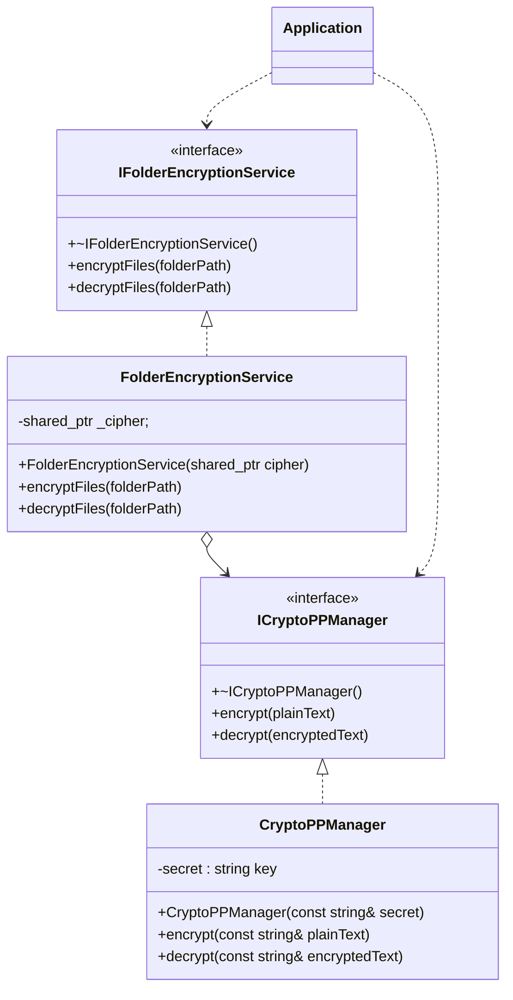

# Лабораторная работа №1
## Рекурсирвный шифратор дерикторий
Потапов Константин 932224

## 1. Постановка задачи
> Реализовать защиту данных пользовательских папок и файлов, находящихся в папке, а также под-папках путем шифрования. Для доступа к данным исходной папке необходимо выполнить дешифрование.

В проекте используется:
- **CMake** v3.20 и новее
- **Стандарт C++** 17

### UML-диаграмма классов

## Постановка задачи
Реализовать защиту данных пользовательских папок и файлов, находящихся в
папке, а также подпапках путем шифрования. Для доступа к данным исходной
папке необходимо выполнить дешифрование.

1 Интерфейс приложения - консоль

2 В качестве основной библиотеки для реализации шифрования

можно взять библиотеку Crypto++ Library, либо Aes256
https://codezup.com/cryptography-security-in-cpp-applications/
https://codezup.com/cpp-aes-256-encryption-implementation/

3 Потребуется реализация рекурсивного обхода папок, с целью шифрования
всех вложенных файлов. Для реализации этой задачи можно воспользоваться
библиотеками Qt.Представляет богатый инструментарий по работе с
директориями и файла.

Можно рассмотреть пример, в котором рассмотрен обход дерева каталогов.

https://pro-prof.com/forums/topic/%D0%BE%D0%B1%D1%85%D0%BE%D0%B4-
%D0%B4%D0%B5%D1%80%D0%B5%D0%B2%D0%B0-
%D0%BA%D0%B0%D1%82%D0%B0%D0%BB%D0%BE
%D0%B3%D0%BE%D0%B2-c-qt

Требование к реализации

1 Язык с++

2 Реализовать основной класс, обеспечивающий шифрование(encryption),

дешифрование (decryption) как Singleton.

3 Входные данные: путь к папке для шифрования/дешифрования, пароль для
шифрования.