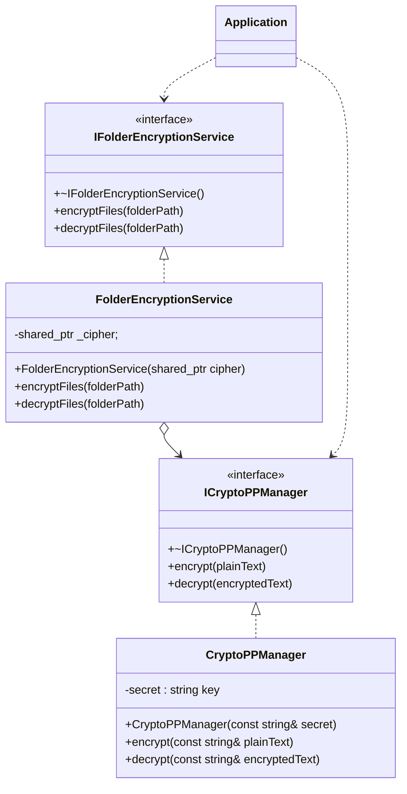

# Лабораторная работа №1
## Рекурсирвный шифратор дерикторий
Потапов Константин 932224

## Постановка задачи
> Реализовать защиту данных пользовательских папок и файлов, находящихся в
> папке, а также подпапках путем шифрования. Для доступа к данным исходной
>папке необходимо выполнить дешифрование.

1 Интерфейс приложения - консоль

2 В качестве основной библиотеки для реализации шифрования

можно взять библиотеку Crypto++ Library, либо Aes256
https://codezup.com/cryptography-security-in-cpp-applications/
https://codezup.com/cpp-aes-256-encryption-implementation/

3 Потребуется реализация рекурсивного обхода папок, с целью шифрования
всех вложенных файлов. Для реализации этой задачи можно воспользоваться
библиотеками Qt.Представляет богатый инструментарий по работе с
директориями и файла.

Можно рассмотреть пример, в котором рассмотрен обход дерева каталогов.

https://pro-prof.com/forums/topic/%D0%BE%D0%B1%D1%85%D0%BE%D0%B4-
%D0%B4%D0%B5%D1%80%D0%B5%D0%B2%D0%B0-
%D0%BA%D0%B0%D1%82%D0%B0%D0%BB%D0%BE
%D0%B3%D0%BE%D0%B2-c-qt

Требование к реализации

1 Язык с++

2 Реализовать основной класс, обеспечивающий шифрование(encryption),

дешифрование (decryption) как Singleton.

3 Входные данные: путь к папке для шифрования/дешифрования, пароль для
шифрования.

В проекте используется:
- **CMake** v3.20 и новее
- **Стандарт C++** 17

# Инструкция по сборке (Windows)

### Клонирование vcpkg
> git clone https://github.com/Microsoft/vcpkg.git
> cd vcpkg

### Запуск установщика
> .\bootstrap-vcpkg.bat

### Интеграция с системой (рекомендуется)
> .\vcpkg integrate install

### Установка пакета Crypto++
> .\vcpkg install cryptopp

### Сборка проекта (Укажите путь к toolchain-файлу vcpkg (замените <vcpkg_root> на реальный путь к папке vcpkg))
> cmake -B build -S . -DCMAKE_TOOLCHAIN_FILE=<vcpkg_root>/scripts/buildsystems/vcpkg.cmake
> cmake --build build

### UML-диаграмма классов

# Функциональные требования
> 1. Шифрование директории – рекурсивный обход всех обычных файлов (исключая служебный маркер) и замена их содержимого на зашифрованное (AES-128 CBC + Base64).
> 2. Расшифрование директории – обратная операция, доступная только при наличии маркера .foldermanager.encrypted.
> 3. Защита от повторного шифрования – после успешного шифрования создаётся маркер, а попытка повторного шифрования вызывает ошибку.
> 4. Проверка состояния при расшифровании – отсутствие маркера воспринимается как незашифрованная папка (операция блокируется).
> 5. Выбор режима работы – при запуске пользователь указывает, что требуется: шифрование или расшифрование.
> 6. Ключ шифрования – временно формируется из пароля усечением/дополнением до 32 байт.
> 7. Пустой путь – если путь к папке не введён, вызывается ошибка о невалидном пути до папки.

# Use-cases

Шифрование папки
=================================
**Actors**: Пользователь 

**Scope**: Folder Encryption Tool

**Purpose**: Зашифровать все файлы внутри указанной папки (включая подпапки), пометив папку как зашифрованную.

**Type**: Primary

**Overview**: Пользователь выбирает операцию «шифрование», вводит путь и пароль. Программа рекурсивно обрабатывает все файлы, заменяя их содержимое и создавая маркер.

Events:
----------------------

| Actor Action | System Response |
|:--------------|:----------------|
| 1. Запускает программу.| 2. Выводит приглашение выбрать действие: 1 — шифрование, 2 — расшифрование. |
| 3. Вводит «1» (шифрование). | 4. Запрашивает путь к папке. |
| 5. Вводит путь к соответствующей директории.| 6. Запрашивает секретный ключ. |
| 7. Вводит пароль. | 8. Проверяет, существует ли папка и не содержит ли маркер .foldermanager.encrypted. Если всё корректно, рекурсивно обходит все обычные файлы, шифрует каждый алгоритмом AES‑128 CBC + Base64 и сохраняет. По завершении создаёт маркер. Выводит количество обработанных файлов. |

Alternative Courses:
-----------
5a. Путь не введён: система использует текущую рабочую директорию.

8a. Папка уже содержит маркер: система выбрасывает исключение с сообщением «Папка уже помечена как зашифрованная».

*8b. Файл недоступен для чтения/записи:* система выводит предупреждение и пропускает этот файл.

Расшифрование папки
=================================
**Actors**: Пользователь 

**Scope**: Folder Encryption Tool

**Purpose**: Расшифровать все файлы в помеченной папке, удалив маркер.

**Type**: Primary

**Overview**: Пользователь выбирает операцию «расшифрование», вводит путь и пароль. Программа обрабатывает все файлы, заменяя зашифрованное содержимое исходным, и удаляет маркер.

Events:
----------------------

| Actor Action | System Response |
|:--------------|:----------------|
| 1. Запускает программу.| 2. Выводит приглашение выбрать действие: 1 — шифрование, 2 — расшифрование. |
| 3. Вводит «2» (расшифрование). | 4. Запрашивает путь к папке. |
| 5. Вводит путь к зашифрованной папке.| 6. Запрашивает секретный ключ. |
| 7. Вводит пароль. | 8. Проверяет существование маркера. Если маркер присутствует, рекурсивно обрабатывает файлы, расшифровывая их. При успешной расшифровке каждого файла перезаписывает его. После обработки всех файлов удаляет маркер. Выводит количество расшифрованных файлов. |

Alternative Courses:
-----------
8a. Маркер отсутствует: система выбрасывает исключение «Папка не помечена как зашифрованная».

8b. Неверный пароль (для отдельного файла): при расшифровке возникает исключение Crypto++. Система выводит ошибку для этого файла и продолжает обработку остальных. Маркер не удаляется.

8c. Файл недоступен: система пропускает файл с предупреждением.

Повторное шифрование
=================================
**Actors**: Пользователь 

**Scope**: Folder Encryption Tool

**Purpose**: Предотвратить двойное шифрование одной и той же папки.

**Type**: Secondary

**Overview**: Пользователь пытается зашифровать папку, которая уже помечена маркером. Система немедленно сообщает об ошибке.

Events:
----------------------

| Actor Action | System Response |
|:--------------|:----------------|
| 1. Выбирает шифрование и указывает папку, уже содержащую .foldermanager.encrypted.| 2. Обнаруживает маркер и выбрасывает исключение «Папка уже помечена как зашифрованная». Завершает операцию без изменений. |

Расшифрование немаркированной папки
=================================
**Actors**: Пользователь 

**Scope**: Folder Encryption Tool

**Purpose**: Обеспечить частичную обработку папки, если отдельные файлы недоступны.

**Type**: Secondary

**Overview**: Во время шифрования или расшифрования некоторые файлы не могут быть открыты. Система пропускает их с предупреждением, продолжая работу с остальными.

Events:
----------------------

| Actor Action | System Response |
|:--------------|:----------------|
| 1. Выбирает расшифрование и указывает папку без .foldermanager.encrypted. | 2. Проверяет наличие маркера и, не найдя его, выбрасывает исключение «Папка не помечена как зашифрованная». |

Обработка недоступных файлов
=================================
**Actors**: Пользователь 

**Scope**: Folder Encryption Tool

**Purpose**: Предотвратить попытку расшифрования папки, не подвергавшейся шифрованию.

**Type**: Secondary

**Overview**: Пользователь пытается расшифровать обычную папку без маркера. Система отказывает с соответствующим сообщением.

Events:
----------------------

| Actor Action | System Response |
|:--------------|:----------------|
| 1. Запускает шифрование/расшифрование папки, содержащей файлы с ограниченными правами. | 2. Для каждого недоступного файла выводит сообщение «Не удалось открыть файл» и переходит к следующему. В итоговом счётчике учитываются только успешно обработанные файлы. |